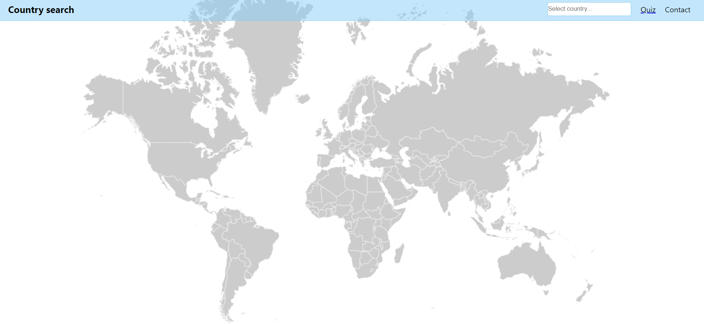
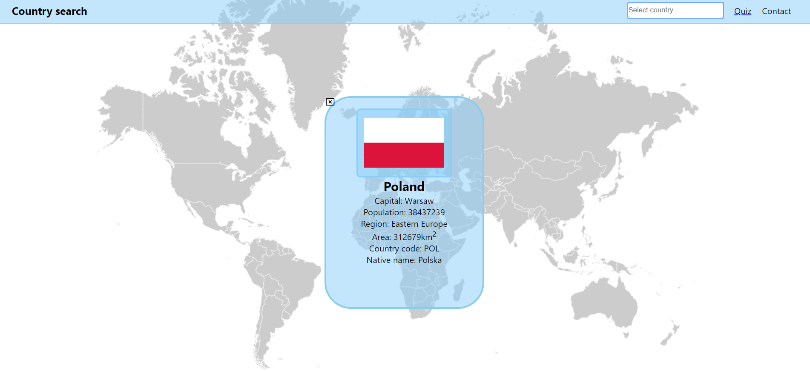
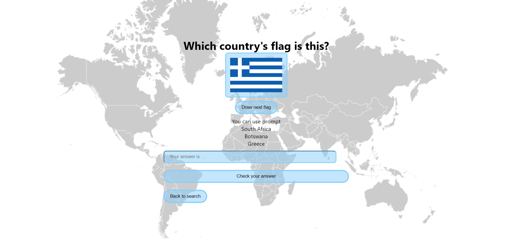

# Info
This aplication was projected and created by Piotr Sitarek. It was my first application in ReactJS technology.
Project is available at https://cranky-kalam-967908.netlify.com/#/

## Technologies
* HTML5
* CSS 3
* ReactJS
* API - https://restcountries.eu/ 
* JSON Server

## Available Scripts

In the project directory, you can run:

### `json-server --watch database.json` in database terminal 
and 
### `npm start`

Runs the app in the development mode. 
Open [http://localhost:3000](http://localhost:3000) to view it in the browser.

The page will reload if you make edits. 
You will also see any lint errors in the console.

## Screenshots

